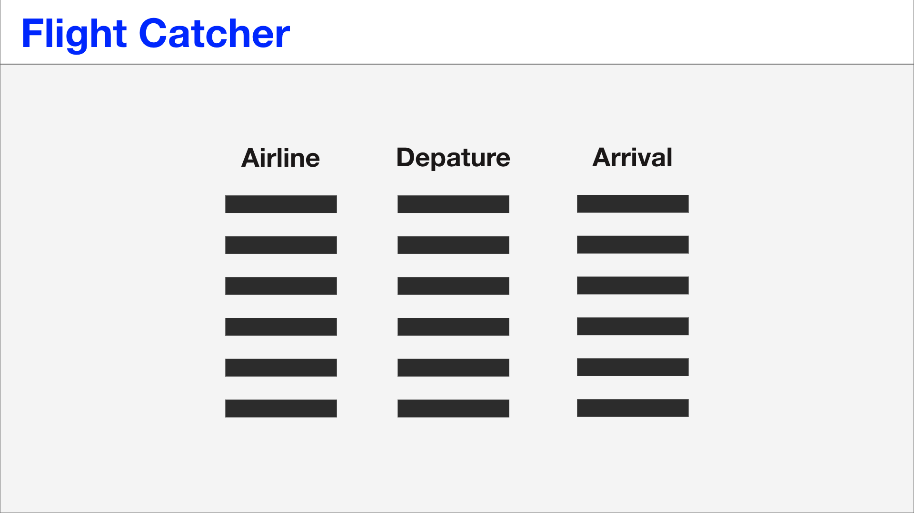
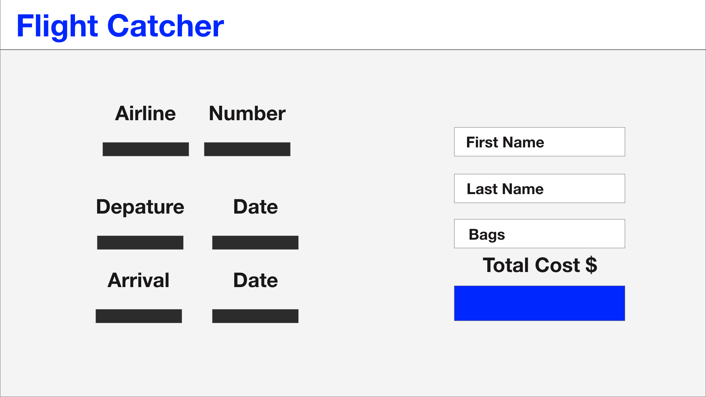
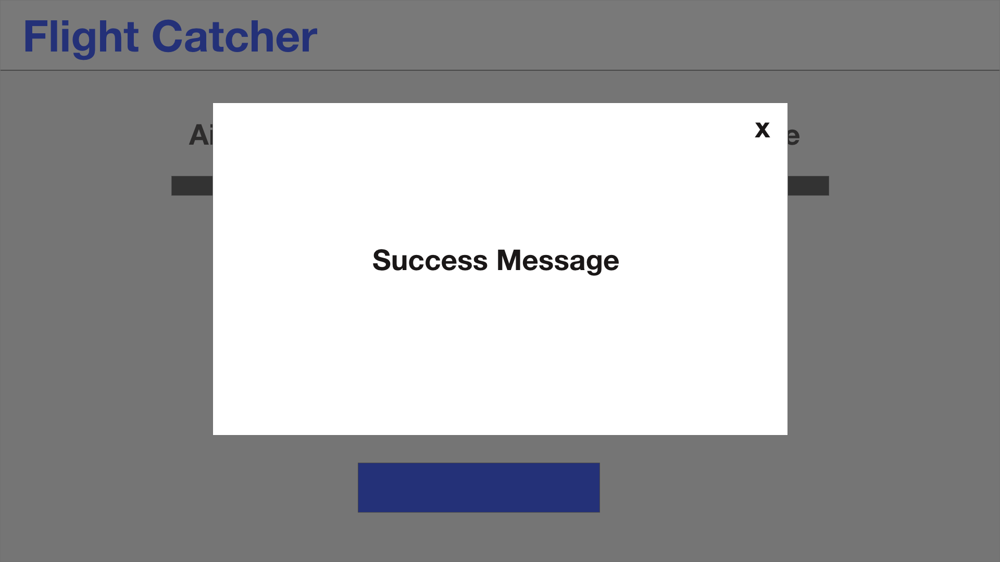
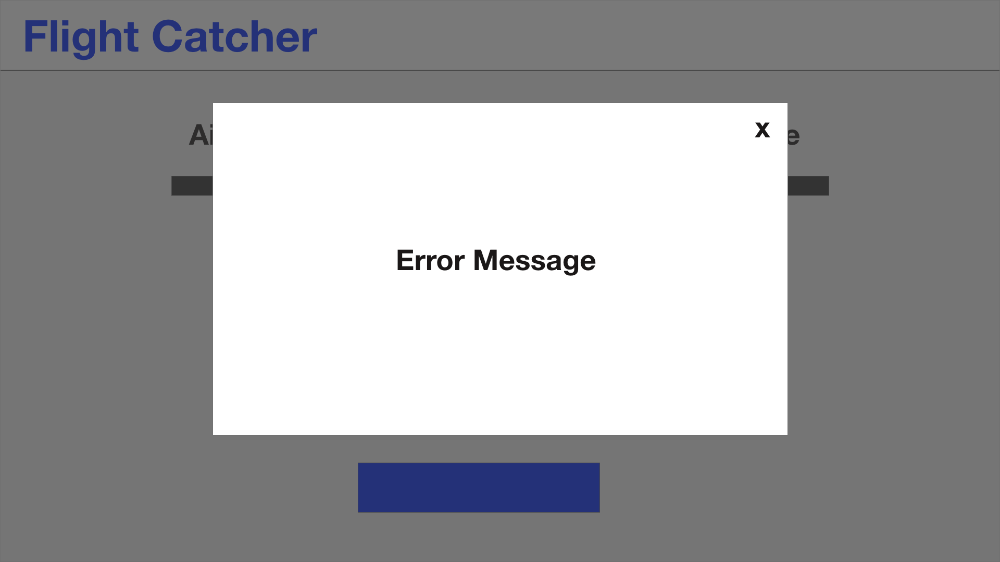

## About 

This is a code challenge for Event Ray 

## Tech Used 

- Python
- React 
- Bulma 

## User Stories
- As a user I can view a list of available flights
- As a user I can choose a flight and view additional information
- As a user I can enter my details for a specific flight
- As a user I will receive confirmation if everything is correct 
- As a user I will receive an error message if my information was not provided correctly 

## Wireframes 

 

 

## Adobe XD 

https://xd.adobe.com/view/19948ca8-b9e4-4a28-5e60-3b69ad6931e0-6fa5/